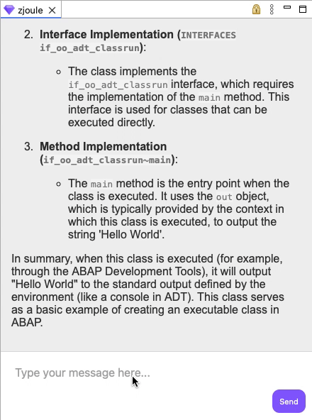
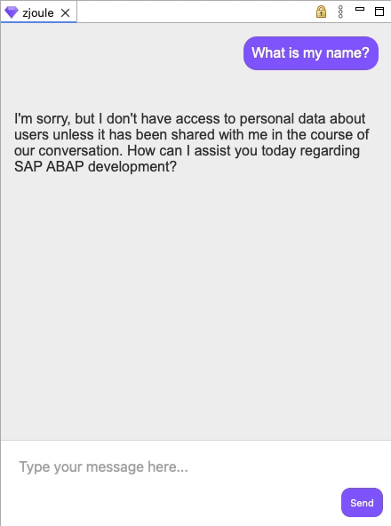

### Asking for code samples.

  

zJoule offers code snippets and on-the-go assistance, helping you learn or recall information without ever leaving your development environment.

### Requesting context information.

  

When the user opens a new component, such as a class or a CDS view, zJoule will retrieve its content and include it as context for the user prompt. A small tag will appear above the input box, indicating the content being used as context.

### Clean up chat history.

  

As the chat progresses, additional information will be collected and shared with the AI assistant to enhance personalization. However, the user can clear the chat history at any time if the accumulated messages are no longer relevant to the conversation.

### Logout from the current SAP AI Core instance.

  

Logging out will erase the chat history and any login data used during the LLM communication process, enabling users to establish new connections entirely independent of previous interactions.